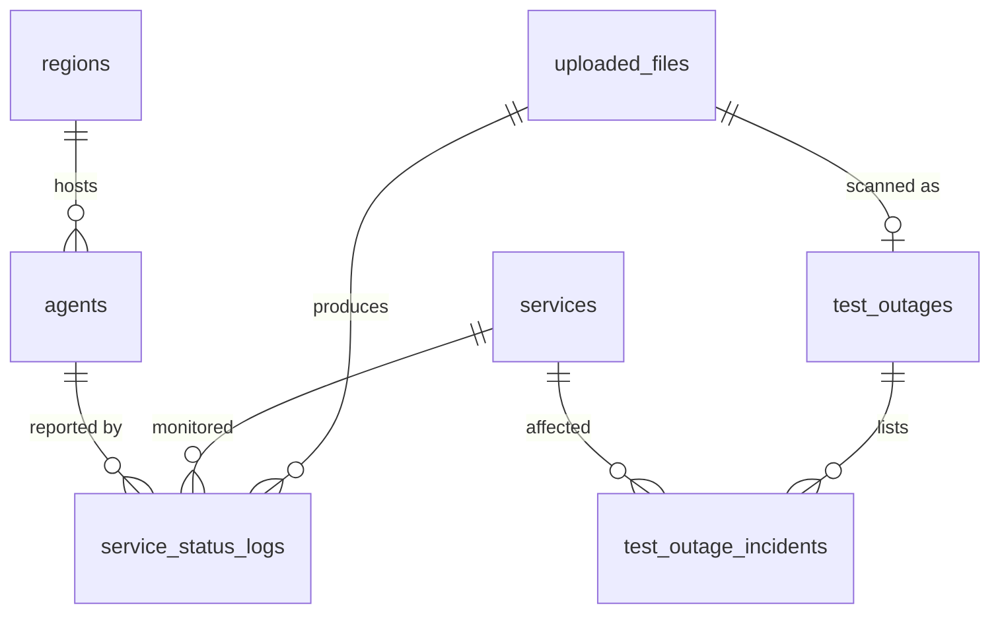

# Database Design — SLA Monitoring Dashboard

The database stores **one clean check per service per 15-minute slot** for every uploaded CSV, plus a small record of each upload. The design is normalized to third normal form (3NF): each fact is stored once, and every stat on the dashboard is calculated from the stored checks.

The assignment only requires that cleaned data is saved and can be queried later. The original CSV rows are not stored; the data problems found and how they were handled are described in the README.

The design fits any relational database. PostgreSQL (e.g. Supabase or Neon free tier) is the likely choice; the final pick is still open in the requirements doc.

---

## 1. Overview



| Group | Table | Holds | Rows |
|---|---|---|---|
| Master | `regions` | Agent locations | 1 |
| Master | `services` | The monitored services | 5 |
| Master | `agents` | Monitoring agents and their region | 2 |
| Transaction | `uploaded_files` | One row per uploaded file | 1 per file |
| Transaction | `service_status_logs` | One clean check per service per slot | 14,400 for the 30-day file |
| Outage scan | `test_outages` | One outage scan per uploaded file: its days and start date | 1 per scanned file |
| Outage scan | `test_outage_incidents` | The incidents that scan found | A few per file |

All 5 sample files together come to about 41,000 clean checks, well inside any free tier.

**7 tables in total:** 3 master, 2 transaction and 2 outage scan tables. Each table must be created after the tables it links to:

1. `regions`
2. `services`
3. `agents` (needs `regions`)
4. `uploaded_files`
5. `service_status_logs` (needs `uploaded_files`, `services`, `agents`)
6. `test_outages` (needs `uploaded_files`)
7. `test_outage_incidents` (needs `test_outages`, `services`)

---

## 2. From CSV to tables

| CSV column | Stored in | What happens |
|---|---|---|
| service_id | `service_status_logs.service_id` → `services` | Checked against known services |
| service_name | `services.service_name` (once) | Stored once per service, not on every check |
| timestamp | `service_status_logs.checked_at` (UTC) | Epoch and +05:30 formats converted to UTC |
| status_code | `service_status_logs.status_code` + `service_status_logs.outcome` | Outcome (up / down / invalid) decided once by the code-range rule |
| latency | `service_status_logs.latency_ms` | Converted to ms; blank or negative → empty (NULL) |
| latency_unit | *(not stored)* | No longer needed once everything is in ms |
| agent | `service_status_logs.agent_id` → `agents` | Agent of the row that was kept |
| region | `agents.region_id` → `regions` | Region belongs to the agent, not the check |

---

## 3. Normalization

| Rule | Problem in the CSV | Fix |
|---|---|---|
| **1NF**: one value per cell, one meaning per column | `latency` means ms on some rows and seconds on others, depending on `latency_unit` | Clean table has one column, `latency_ms`, always in milliseconds |
| **2NF**: every column depends on the whole key | `service_name` depends only on `service_id`, and repeats on 14,400 rows | Moved to `services`, stored once |
| **3NF**: no column depends on another non-key column | `region` depends on the agent, not the check | Moved to `agents.region_id` |
| **No derived data** | Availability, downtime, incidents and date range can all be calculated from `service_status_logs` | Not stored; calculated when the dashboard asks (section 9) |

**Assumption:** each agent always reports from one region. This is true in the sample files (every row is `ap-south-1`). If an agent ever reports from two regions, the cleaner flags it, and `region` would have to move back onto the check.

**Deliberate exception 1:** `service_status_logs.outcome` depends only on `service_status_logs.status_code`, which strict 3NF would move into its own table. It's kept on the check on purpose, to avoid an extra table for a fixed rule with ~5 values. The outcome is set once by the cleaner, so every screen reads the same value. The cost: if the code-range rule ever changes, existing uploaded files must be re-processed.

**Deliberate exception 2:** `rows_received` on `uploaded_files` is stored, not calculated. It describes the original CSV, which is not kept, so it can't be recalculated later.

---

## 4. Master tables

### `regions`

| Column | Type | Rules | Example |
|---|---|---|---|
| region_id | text | Primary key | ap-south-1 |

### `services`

| Column | Type | Rules | Example |
|---|---|---|---|
| service_id | text | Primary key | svc-search |
| service_name | text | Required, unique | search-api |

### `agents`

| Column | Type | Rules | Example |
|---|---|---|---|
| agent_id | text | Primary key | agent-1 |
| region_id | text | Required, links to `regions` | ap-south-1 |

---

## 5. Transaction tables

### `uploaded_files`: one row per file

| Column | Type | Rules | Example |
|---|---|---|---|
| file_id | auto number | Primary key | 2 |
| file_name | text | Required | monitoring_checks_12d_seed505.csv |
| uploaded_at | timestamp (UTC) | Required, defaults to now | 2026-09-22 10:05 |
| status | text | `processing`, `done` or `failed` | done |
| error_message | text | Only when status is `failed` | Missing column: latency |
| rows_received | integer | Data lines in the CSV (header not counted) | 6,230 |

- `file_name` is shown in the dashboard's file selector, and traces every number back to its source file.
- `file_name` is **not** unique. Uploading the same file again creates a new row with its own `file_id`, so its checks are stored again and it appears twice in the file selector. Numbers never mix, because every check belongs to one `file_id`.
- `rows_received` starts at 0; the cleaner fills it in.
- Lines removed is **not** stored, because it can be calculated: `rows_received` − number of clean checks. For the 12d file: 6,230 − 5,760 = 470. This number covers duplicates **and** any rejected lines together; in the sample files no line is rejected, so all 470 are duplicates.
- The date range is **not** stored, because it can be calculated from `service_status_logs`.

### `service_status_logs`: one clean check per service per 15-minute slot

| Column | Type | Rules | Example |
|---|---|---|---|
| status_log_id | auto number | Primary key | 3401 |
| file_id | number | Required, links to `uploaded_files` | 2 |
| service_id | text | Required, links to `services` | svc-search |
| checked_at | timestamp (UTC) | Required, must be on :00, :15, :30 or :45 | 2025-04-14 12:15:00 |
| status_code | small integer | Required | 503 |
| outcome | text | Required: `up`, `down` or `invalid` | down |
| latency_ms | decimal | Empty when blank or negative in CSV; otherwise 0 or more | 2400.000 |
| agent_id | text | Required, links to `agents` | agent-1 |

**Unique together:** `file_id` + `service_id` + `checked_at`.

**How `outcome` is decided** (by the cleaner, once, when the check is saved):

| Code range | Outcome |
|---|---|
| 200–299 | up |
| 300–399 | up |
| 500–599 | down |
| anything else (1xx, 4xx, 999, ...) | invalid |

Checks with an `invalid` outcome (like `999`) stay visible in the logs but are excluded from availability (decision D2).

**Indexes** (for fast date filtering in the logs view):
- `file_id` + `checked_at`
- `file_id` + `service_id` + `checked_at`

Design notes:
- The unique key includes `file_id`. The same time slot in two different files is **not** a duplicate: the sample files overlap in April 2025 but disagree on values (e.g. svc-reports on Apr 12 at 17:00 is `502` in the 12d file and `200` in the 30d file), so they're separate datasets (decision D4).
- The database itself should refuse a second check for the same slot, a negative latency, or a timestamp off the 15-minute grid, as a safety net if the cleaning logic has a bug.
- `latency_ms` is a decimal, not a whole number, so `0.717 s` becomes exactly `717 ms` with no rounding.

---

## 6. Outage scan tables

`POST /outage?file_id=…` finds the incidents in one uploaded file's `service_status_logs` and stores them here. The input is only the stored checks, never `dataset_incident_log.json`.

Both tables are keyed by `file_id`, not file name. File names repeat (the same CSV uploaded twice, or a corrected file under the same name), and each upload is its own dataset with its own scan. Deleting an upload deletes its scan with it.

### `test_outages`: one row per scanned file

| Column | Type | Rules | Example |
|---|---|---|---|
| file_id | number | Primary key, links to `uploaded_files` | 2 |
| days | integer | Required, more than 0 | 9 |
| start_date | date | Required | 2025-05-08 |

### `test_outage_incidents`: one row per incident, per day

| Column | Type | Rules | Example |
|---|---|---|---|
| incident_id | auto number | Primary key | 1 |
| file_id | number | Required, links to `test_outages` | 2 |
| service_id | text | Required, links to `services` | svc-reports |
| day_index | integer | Required, 0 = first day of the file | 5 |
| checkpoint_start | integer | Required, 0–95 | 64 |
| checkpoint_end | integer | Required, 0–95, ≥ checkpoint_start | 69 |

**Unique together:** `file_id` + `service_id` + `day_index` + `checkpoint_start`.

An incident that runs past midnight is stored as one row per day, because a row covers check-points within a single day.

**Calculated, not stored** (normalization: these follow from the stored columns):

| Value | Calculation | Example |
|---|---|---|
| Incident date | `start_date` + `day_index` days | 2025-05-08 + 5 = 2025-05-13 |
| Start time | `checkpoint_start` × 15 minutes | 64 × 15 = 16:00 UTC |
| Last failing check | `checkpoint_end` × 15 minutes | 69 × 15 = 17:15 UTC |
| Expected clean checks | `days` × 96 × 5 services | 9 × 96 × 5 = 4,320 |

**How the data gets in:** written by the outage scan, once per file. Scanning a file again reads the stored rows back instead of writing them twice.

---

## 7. Starting data

**services**

| service_id | service_name |
|---|---|
| svc-auth | auth-api |
| svc-notify | notify-worker |
| svc-payments | payments-api |
| svc-reports | reports-api |
| svc-search | search-api |

**agents**

| agent_id | region_id |
|---|---|
| agent-1 | ap-south-1 |
| agent-2 | ap-south-1 |

These services and agents are the ones found in the sample files. New ones in a future file are added automatically; the same `service_id` arriving with a different name is flagged as a conflict.

---

## 8. How an upload is saved

1. Add the `uploaded_files` row with status `processing` and `rows_received` at 0, and save it straight away (on its own, outside the transaction below).
2. **Start a transaction.**
3. For each CSV line: read it, convert the time to UTC and latency to ms, and decide the outcome from the status code. Count every line in `rows_received`. A line that can't be cleaned is skipped.
4. Group lines by service + UTC time. From each group keep **one** line:
    - if any line in the group is `down`, keep the first down line (decision D1: a failure seen by any agent counts);
    - otherwise, if any line is `up`, keep the first up line (a valid reading beats an invalid code: in the 14d file agent-2's `200` is kept over agent-1's `999`);
    - otherwise keep the first line.

    Every other line in the group is dropped as a duplicate.
5. Save one `service_status_logs` row per group, save `rows_received` on the `uploaded_files` row, and set its status to `done`.
6. **Commit the transaction.**

If anything fails in steps 2–6, the transaction is rolled back, so no checks from this file are saved. The `uploaded_files` row still exists from step 1, and is then updated to status `failed` with an `error_message`. A half-saved file can never appear on the dashboard, because the file selector only shows uploaded files with status `done`.

**`uploaded_files` row lifecycle:** inserted once (step 1) → updated once (to `done` in step 5, or to `failed` on error) → never changed again. A failed file can be retried by uploading it again, which creates a new row.

---

## 9. Example: one slot, two CSV lines

Two lines of the 12-day file (illustrative):

```
svc-search,search-api,1744632900,503,2.4,s,agent-1,ap-south-1
svc-search,search-api,2025-04-14T12:15:00Z,503,2.4,s,agent-2,ap-south-1
```

Both lines describe the same check: search-api at 12:15 UTC on 14 April. One timestamp is written as an epoch number, and latency is in seconds.

**service_status_logs**: one row is saved

| status_log_id | file_id | service_id | checked_at | status_code | outcome | latency_ms | agent_id |
|---|---|---|---|---|---|---|---|
| 3401 | 2 | svc-search | 2025-04-14 12:15 UTC | 503 | down | 2400 | agent-1 |

**uploaded_files**: `rows_received` goes up by 2 (both lines were read). The agent-2 line is dropped as a duplicate, so the file ends up with one line more than it has clean checks.

---

## 10. What the dashboard calculates from these tables

| Dashboard item | Comes from | Calculation |
|---|---|---|
| File selector | `uploaded_files` + `service_status_logs` | File name, plus first and last `checked_at` as the date range |
| Availability | `service_status_logs.outcome` | up checks ÷ (up + down checks) × 100, per service per month; `invalid` excluded |
| Failed checks | `service_status_logs.outcome` | Count of `down` checks |
| Downtime | same | Failed checks × 15 minutes |
| Best-case month | same | (days in month × 96 − failed) ÷ (days in month × 96) × 100 |
| SLA status | calculated above | Best case < 99.9% → Breached (confirmed); full month ≥ 99.9% → Met; otherwise Met so far (provisional) |
| Incidents | `service_status_logs` | Runs of down checks on one service, merged across short gaps (decision D5) |
| Latency p50 / p95 / max | `service_status_logs.latency_ms` | Ignoring empty values |
| Data quality section | `uploaded_files` + `service_status_logs` | Rows received, clean checks (count of `service_status_logs`), and lines removed (received − clean) |
| Missing checks | `service_status_logs` | Every expected 15-minute slot with no check |
| Logs view | `service_status_logs` + `services` | Filter by `checked_at` from start date 00:00 to the day after the end date 00:00 UTC, optionally by service; paged |

---

## 11. What is deliberately not stored

| Not stored | Why |
|---|---|
| Original CSV lines | Not required by the assignment. Data findings are described in the README; only `rows_received` is kept on `uploaded_files` |
| Rejected lines | Not stored or counted separately; they're included in "lines removed". Acceptable because none of the sample files has a rejected line |
| Availability, downtime, SLA status | Calculated from `service_status_logs`, so they can never go stale |
| Incidents | Calculated from runs of down checks |
| Date range on `uploaded_files` | Calculated from `service_status_logs` |
| `latency_unit` on clean checks | Everything is in ms |
| `service_name` and `region` on each check | Stored once in `services` and `agents` |
| `dataset_incident_log.json` | Not loaded. Every incident comes from the stored checks |

**Trade-off:** calculating on every request is slower than reading saved numbers, but with at most ~15,000 checks per file it stays well under a second. With millions of rows, the SLA summary would be pre-calculated after each upload instead.
