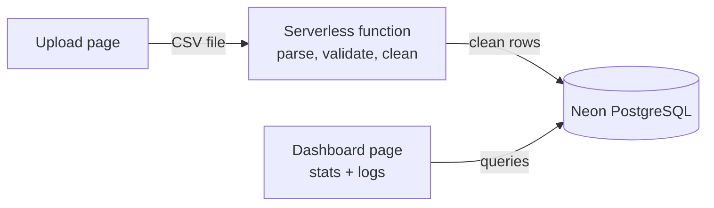

# SLA Monitoring Dashboard

Upload a CSV of health-check logs, clean it in a cloud function, store it in PostgreSQL, and see SLA status, incidents and the underlying check records on one dashboard page.

> **Status:** design complete, build in progress. Sections marked **TBD** will be filled in as each part is built and deployed.

**Live URL:** TBD
**Last verified live:** TBD

---

## 1. Architecture



| Part | Runs on | Why |
|---|---|---|
| Upload page | TBD | |
| API (FastAPI) | **AWS Lambda + Function URL** (via Mangum) | Free at this volume and never sleeps (a cold start is about 1–2 s, where free web hosts take 30–60 s to wake). Same account and region as the bucket. Checks the file and stores it in S3; reads stats and logs from the database. Limit: a Lambda request is at most 6 MB, so uploads are capped at 4 MB. Deploy steps: [BE/README.md](BE/README.md#deploy-to-aws-lambda) |
| Serverless function | **AWS Lambda, triggered by S3** | Must be a real deployed cloud function (assignment requirement). It is stateless: it keeps nothing between calls, and everything needed later is written to the database. Parses, validates and cleans the CSV, then saves the checks and incidents. Deploy steps: [AWS/README.md](AWS/README.md) |
| Database | **Neon** (PostgreSQL, free tier) | Relational data with clear links between files, services and checks; SQL handles date-range filters and per-month aggregates well; free tier needs no credit card; provides a pooled connection suited to serverless functions |
| Dashboard page | TBD | |

### Database

7 tables, normalized to third normal form. Full design: [database.md](database.md).

| Table | Type | Holds |
|---|---|---|
| `regions` | Master | Agent locations |
| `services` | Master | The 5 monitored services |
| `agents` | Master | Monitoring agents and their region |
| `uploaded_files` | Transaction | One row per uploaded file |
| `service_status_logs` | Transaction | One clean check per service per 15-minute slot |
| `test_outages` | Outage scan | Days and start date per uploaded file |
| `test_outage_incidents` | Outage scan | The incidents found in each uploaded file |

Only clean data is stored. Availability, downtime and latency are calculated from `service_status_logs` when the dashboard asks, so they can never go out of date.

The two outage scan tables are written only by the Lambda (`AWS/lambda_function.py`), in the same transaction that saves a file's checks. The API only reads them. They are built from the stored checks, never from `dataset_incident_log.json`, which is used only to **verify** the pipeline's output.

---

## 2. Data findings

All 5 sample files were profiled. Every file has the same kinds of defects, placed on different services and times, so the cleaning rules are general rather than tied to one file.

### Summary by file

| | 9d | 12d | 14d | 21d | 30d |
|---|---|---|---|---|---|
| Date range | May 8–16 | Apr 10–21 | May 19 – Jun 1 | Apr 3–23 | Apr 6 – May 5 |
| CSV lines | 4,672 | 6,230 | 7,269 | 10,904 | 15,577 |
| Clean checks | 4,320 | 5,760 | 6,720 | 10,080 | 14,400 |
| Expected (5 × 96 × days) | 4,320 | 5,760 | 6,720 | 10,080 | 14,400 |

After cleaning, every file matches its expected count exactly: **no missing checks** in any file.

### Issues found and how they were handled

| # | Issue | 9d | 12d | 14d | 21d | 30d | Handling |
|---|---|---|---|---|---|---|---|
| 1 | **Duplicate checks**: the same service and time reported more than once | 352 | 470 | 549 | 824 | 1,177 | Keep one row per service + UTC time slot (see decision D1) |
| | of which byte-for-byte identical rows | 6 | 8 | 10 | 18 | 24 | |
| | of which a second agent (agent-2) reporting the same slot | the rest | | | | | |
| 2 | **Timestamp as Unix epoch** (e.g. `1746938700`) | 70 | 93 | 109 | 163 | 233 | Converted to UTC |
| 3 | **Timestamp with +05:30 offset** (IST) | 32 | 43 | 50 | 76 | 109 | Converted to UTC. The offset is never stripped: that would shift the time by 5.5 hours and can move a check to the wrong day or month |
| 4 | **Latency in seconds** (`latency_unit = s`), always and only for search-api | 935 | 1,242 | 1,452 | 2,184 | 3,131 | Multiplied by 1000 and stored as `latency_ms` |
| 5 | **Blank latency** | 56 | 74 | 87 | 130 | 186 | Stored as empty (NULL). The check still counts for availability but is excluded from latency stats |
| 6 | **Negative latency** (e.g. `-286` ms) | 1 | 1 | 1 | 1 | 1 | Stored as empty, same as blank |
| 7 | **Invalid status code `999`** | 1 | 1 | 1 | 1 | 1 | Outcome `invalid`: shown in the logs, excluded from availability (decision D2) |
| 8 | **Agents disagree** on a duplicated check | 0 | 0 | 1 | 0 | 0 | See decision D1. The one case is `999` from agent-1 vs `200` from agent-2 (search-api, 2025-05-31 11:00 UTC) |

### Other observations

- **Once converted to UTC, every timestamp lands on a 15-minute boundary.** This is used as a validation rule: a time off the grid means parsing went wrong.
- **The unit trap is dangerous, not just untidy.** In the 12d file the largest raw latency value is `919` (ms), but the true worst check is `2.452` s = **2,452 ms**. Ignoring the unit column would hide the slowest checks in the file.
- **Slow but "up" (brownouts):** during the seeded search-api outages in the 12d file, some checks returned `200` but took over 2 seconds. Availability counts them as up; the latency stats (p95, max) make them visible.
- **Background errors:** besides the seeded outages, every file has scattered 5xx errors on several services.
- **`region` is always `ap-south-1`** in every file, so it carries no information for analysis.
- **`service_name` always maps 1:1 to `service_id`**, so it is stored once in `services`.
- **The sample files overlap in time but disagree.** The 12d, 21d and 30d files all cover April 2025, yet the same slot can differ (svc-reports on Apr 12 at 17:00 is `502` in the 12d file and `200` in the 30d file). They are separate datasets, not copies (decision D4).
- **Two files cross a month boundary:** 14d (May → June) and 30d (April → May). This matters because the SLA is monthly (decision D6).
- **No line in any file needed to be rejected.** Every line has 8 columns, a known service, a known unit, a readable timestamp and a numeric status code.

---

## 3. Assumptions and decisions

### How numbers are calculated

| Metric | Definition |
|---|---|
| Up / down | 2xx or 3xx = **up**; 5xx = **down**; anything else (1xx, 4xx, 999) = **invalid** |
| Availability | up checks ÷ (up + down checks) × 100. Invalid checks are excluded |
| Downtime | down checks × 15 minutes. Each check represents the 15-minute slot it belongs to; the monitoring interval sets the resolution, so an outage's true length can differ by up to 15 minutes |
| SLA met | availability ≥ 99.9% for the calendar month |
| Latency | p50, p95 and max, in ms, ignoring empty values. Average latency is not shown because one spike distorts it |

### Decisions where the spec was open

| ID | Question | Decision | Why |
|---|---|---|---|
| D1 | Duplicate rows for one slot disagree | Keep the most serious valid result: **down** if any row is down, else **up** if any row is up, else **invalid** | A failure seen by any agent is real evidence, and the SLA protects the customer. A valid reading beats an invalid code: in the 14d file agent-2's `200` is kept over agent-1's `999` |
| D2 | Invalid status code (`999`) | Excluded from availability, still visible in the logs | It is not a real response, so it proves neither up nor down |
| D3 | Missing checks | Detected and reported; not counted as down | No data is not the same as a failure. No sample file has any |
| D4 | Two files cover the same dates | Each upload is a **separate dataset**; the dashboard shows one file at a time | The overlapping sample files disagree, so merging them would have no correct answer |
| D5 | Where one incident ends | Down checks on one service are merged into one incident when separated by short healthy gaps | Real outages flicker: the seeded svc-reports outage (9d file, May 13) alternates 502, 200, 503, 200, 500 |
| D6 | Files are not whole months | SLA is calculated **per calendar month** inside the file, with a best-case check (below) | The SLA is defined monthly |
| D7 | Do stats follow the logs date filter? | Yes, labelled as "availability for selected range" | More useful for investigation; the SLA status itself stays per month |

### Monthly SLA with partial months (D6)

No sample file covers a whole month, so the dashboard asks: *even if every missing day of the month were perfect, would the service still breach?*

```
best-case month = (days in month × 96 − down checks) ÷ (days in month × 96) × 100
```

| Status | Rule |
|---|---|
| **Breached (confirmed)** | Best case is below 99.9%: the month cannot recover |
| **Met (full month)** | All days present and availability ≥ 99.9% |
| **Met so far (provisional)** | Looks fine, but days are missing |

A full 30-day month allows only 2.88 failed checks (30 × 96 × 0.1%), so 3 failures anywhere in the month confirm a breach. Because every file has background 5xx errors, most services show **Breached (confirmed)**. This is the correct result, not a bug.

### Stats shown, and why

The stats section is built for three readers: **billing** (do we owe a credit?), **on-call** (what broke, when, for how long?), and **anyone checking the numbers** (can this data be trusted?).

| Section | For | Shows |
|---|---|---|
| SLA summary | Billing | Per service, per month: availability, failed checks, downtime, best-case month, status |
| Incidents | On-call | Service, start, end, duration, error codes; newest first |
| Latency | On-call | p50, p95, max per service; exposes slow-but-up periods |
| Data quality | Trust | CSV lines received, clean checks, lines removed |

**Deliberately not shown:** region (one value only), agent-1 vs agent-2 comparison (they report the same checks), average latency (distorted by spikes), and credit amounts (the spec gives no credit rules).

### Other assumptions

- All times are stored and shown in UTC.
- Each agent always reports from one region (true in every sample file).
- The same file uploaded twice is stored twice, as two separate uploads. Numbers never mix, because every check belongs to one uploaded file.
- `dataset_incident_log.json` is treated as an answer key: used to verify results, never as input to any stat.

---

## 4. Running and deploying

**Live URL:** TBD
**Last verified live:** TBD

### Environment variables

Copy [.env.example](.env.example) to `.env` and fill in your Neon details (Neon console → your project → **Connect**). Use the pooled host (containing `-pooler`) for the serverless function. Never commit `.env`.

| Variable | Purpose |
|---|---|
| `DATABASE_URL` | The full Neon connection string, including `sslmode=require` |

### Run locally

TBD

### Redeploy

| Part | How |
|---|---|
| API | [BE/README.md → Deploy to AWS Lambda](BE/README.md#deploy-to-aws-lambda). After a code change: rebuild the zip and run `aws lambda update-function-code` |
| Upload processor | [AWS/README.md](AWS/README.md). After a code change: rebuild the zip and run `aws lambda update-function-code` |
| Database tables | `alembic upgrade head` from `BE/` ([BE/README.md](BE/README.md#database)) |
| Dashboard | TBD |

### Verify with the sample files

Upload each of the 5 CSVs and check the dashboard against `dataset_incident_log.json`:

| File | Expected clean checks | Seeded outages to find |
|---|---|---|
| 9d | 4,320 | svc-reports, May 13, ~16:00–17:15 UTC |
| 12d | 5,760 | svc-search, Apr 14, ~12:00–16:45; svc-search, Apr 18, ~12:15–13:30 |
| 14d | 6,720 | svc-notify, May 19, ~14:45–19:15; svc-notify, May 25, ~07:30–10:00 |
| 21d | 10,080 | svc-payments, Apr 5, ~09:30–15:00 |
| 30d | 14,400 | svc-auth, Apr 22, ~04:00–10:15; svc-reports, Apr 9, ~11:45–13:45 |

A detected incident should overlap the seeded window on the right service and date. It may run slightly longer, because failures sometimes continue past the listed window.

---

## 5. What I'd do differently with more time

- **Detect repeat uploads** with a fingerprint of the file content (SHA-256), so the same file isn't stored twice even if renamed.
- **Keep the original CSV lines** in the database for a full audit trail: which raw lines produced each clean check, and which problems each line had.
- **Support large files** by uploading to cloud storage first and having the function read from there, instead of sending the file in the request (serverless functions accept only a few MB per request).
- **Make the up/down rule configurable** with a status-code table, so a code such as 429 can be reclassified without a code change.
- **Decide on 4xx codes explicitly.** They are currently `invalid`. None appear in the sample data, but a health check returning 404 arguably means the service is down.
- **Add credit tiers** (e.g. a bigger outage gives a bigger credit) once real SLA terms are known.
- **Pre-calculate the SLA summary** after each upload if data grew to millions of rows.
- **Automated tests** that run all 5 sample files and compare results against `dataset_incident_log.json`.
